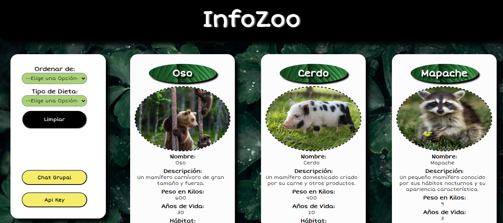

# Dataverse Chat

## Índice

* [1. Preámbulo](#1-preámbulo)
* [2. Resumen del proyecto](#2-resumen-del-proyecto)
* [3. Historias de Usuario](#3-historias de usuario)

***

## 1. Preámbulo

Los animales son seres vivos. Al igual que las plantas, nacen, crecen, 
se alimentan, respiran y se relacionan con su entorno.

Son parte importante de nuestro ecosistema, por eso debemos  tener el
conocimiento hacia ellos, donde habitan, que comen, cuanto viven, cuanto
pesan, etc.

Ya que el conocerlos nos hace tener la consciencia de cuidarlos y protegerlos.

## 2. Resumen del proyecto

En este proyecto se mostrarán tarjetas de varios animales los cuales podremos seleccionar
de acuerdo a su tipo de dieta.

También podremos tener una plática por medio de la inteligencia artificial (IA) con algun 
animal específico elegido  por nosotros y así poder preguntar cualquier duda que tengamos 
de ellos

También si lo deseamos, podremos pláticar en grupo. 

## 3. Historias de Usuario

1.- Vista Principal

En la pantalla podrás ver todas las tarjetas con la información de cada uno de nuestros personajes (animales) mostrando su imagen, así como sus datos como son: Nombre, descripción, peso en kilos, años de vida, hábitat y dieta.
En el módulo de ordenamiento, puedes hacer lo siguiente: 
•	Ordenar nuestras tarjetas alfabéticamente de la A - Z y de la Z - A.
•	Filtrar las tarjetas por tipo de dieta
•	Botón limpiar que nos regresa a nuestra pantalla principal
•	Botón de chat grupal, que nos direcciona a nuestra pantalla de chat grupal
•	Botón de Api Key, nos permite ingresar nuestra Api para tener acceso a nuestros Chats ya sean grupal o individual. 

2.- Filtro de ordenamiento

En el primer filtro que es el de ordenamiento como usuaria quiero ver como ordenar mis tarjetas alfabéticamente de la A – Z y de la Z – A, dependiendo la opción elegida.
En el filtro de tipo de dieta elegirás entre una lista la cual incluye: Omnívoros, Insectívoros, Frugívoros, Carnívoros y Herbívoros y dependiendo de cuál sea la elegida se presentarán en la pantalla las tarjetas seleccionadas.

3.- Api Key

Aquí como usuaria debes introducir tu Api Key, la cuál para ser agregada solo debes darle un click al botón entrar y así queda guardada en tu aplicación. Posteriormente dale click al botón Home que se encuentra en la parte superior izquierda y te regresa a la pantalla principal.
Esta Api Key será muy importante para utilizar tus Chats individual y grupal, de lo contrario no funcionarán tus módulos.

4.- Chat individual

Para que tengas una interacción con alguno de nuestros personajes solo tienes que hacer un click en la tarjeta seleccionada, y esto nos llevará al chat individual con el animal seleccionado.

(Anexar Pantalla del Chat individual)

Aquí en el texto que indica “Escribe Algo” debes ingresar un texto para platicar con tu personaje y darle “Enviar” o darle “Enter” para comenzar a charlar.
Lo cual se visualizará en el texto principal, primero lo que la usuaria ingresó y después lo que te contesta tu animal seleccionado.
Para salir de tu pantalla solo tienes que darle un click en tu botón Home que se encuentra en la parte superior izquierda y te regresa a la pantalla principal, en la cual puedes volver a elegir otro personaje para poder chatear con él.

5.- Chat Grupal

Como usuaria podrás entrar al chat grupal dando click al botón el cual te presentará toda la lista de tus animales, en el cual podrás conversar con todos al mismo tiempo.

(Anexar pantalla del Chat Grupal)

Debes escribir algo en el texto que indica “Escribe algo” y posteriormente dar click en el botón enviar o darle “Enter” para comenzar a charlar.
Lo cual se visualizará en el texto principal, primero lo que la usuaria ingresó y después lo que te contestan todos los animales en tu chat grupal.
Para salir de tu pantalla solo tienes que darle un click en tu botón Home que se encuentra en la parte superior izquierda y te regresa a la pantalla principal.
